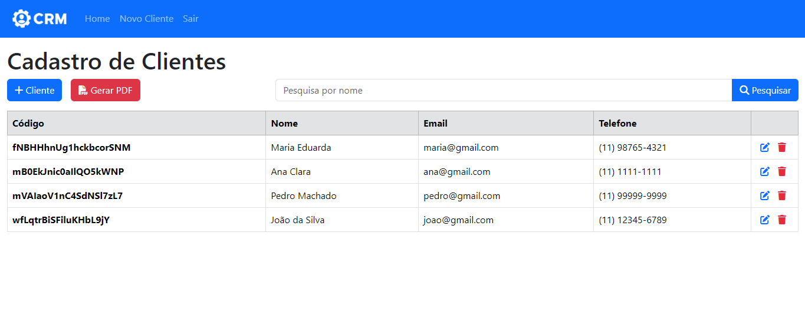

# CRM System

Este repositório contém um sistema de CRM (Customer Relationship Management) desenvolvido utilizando React para o front-end e Firebase para o backend e autenticação.

<p align="center">
    
    </a>
</p>

### Tecnologias Utilizadas 🛠️

[](https://skillicons.dev)

### Principais Recursos ⚙️

* **Gerenciamento de Clientes:** Adicionar, editar e excluir informações de clientes facilmente.

* **Autenticação de Usuários:** Autenticação de usuários com Firebase Authentication e controle de acesso à aplicação.

* **Armazenamento e Consulta de Dados:** Utiliza o Firestore para armazenar e consultar dados dos clientes de forma eficiente e em tempo real.

* **React Hooks:** Utiliza o React Hooks para otimizar a lógica dos componentes e gerenciar estados complexos de forma mais intuitiva e eficiente.

* **Context API:** Utilização do Context API para gerenciar o estado global da aplicação, facilitando a comunicação entre componentes.

### Como Rodar o Projeto Localmente 🚀

1. **Clone o repositório**:

```bash
git clone https://github.com/joschonarth/crm-system.git
```

2. **Instale as dependências do Node Modules**:

```bash
npm install
```

3. **🔥Configure as credenciais do Firebase**:
- Crie um projeto no [Firebase Console](https://console.firebase.google.com/).
- Copie as credenciais do seu projeto Firebase para o arquivo de configuração no React (`src/app/config/firebase.js`).
- Em Firestore Database crie uma Collection de nome `clientes`.

4. **Inicie o servidor de desenvolvimento**:

```bash
npm start
```

5. **Acesse o aplicativo**:

Abra [http://localhost:3000](http://localhost:3000) no seu navegador.


## Contato 📞

<div>
    <a href="https://www.linkedin.com/in/joschonarth/" target="_blank"></a>
    <a href="mailto:joschonarth@gmail.com" target="_blank"></a>
</div>